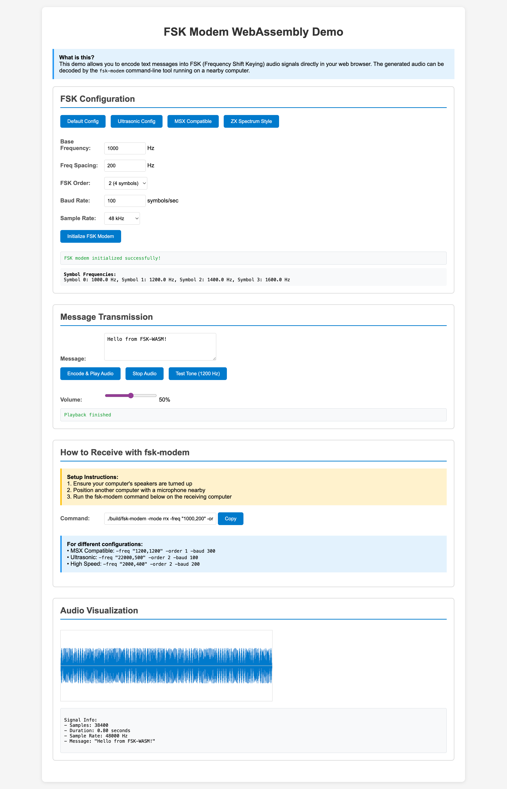

# FSK WebAssembly Demo

This directory contains a WebAssembly (WASM) implementation of the FSK library that runs in web browsers, allowing you to encode text messages into FSK audio signals that can be decoded by the `fsk-modem` command-line tool.

## Quick Start

### Option 1: Using Make (Recommended)

```bash
# Build and serve the demo
make wasm-serve

# Then open http://localhost:8080 in your browser
```


### Option 2: Manual Setup

```bash
# Build WASM files
make wasm

# Serve the directory (choose one):
cd wasm && python3 -m http.server 8080
cd wasm && python -m SimpleHTTPServer 8080  # Python 2
cd wasm && npx serve .                       # Node.js

# Open http://localhost:8080 in your browser
```

## How It Works

### Browser Side (Transmitter)

1. **Load the demo page** in your web browser
2. **Configure FSK parameters** (frequency, baud rate, etc.)
3. **Type a message** in the text box
4. **Click "Encode & Play Audio"** to broadcast the FSK signal through your speakers

### Computer Side (Receiver)

1. **Position a computer with microphone** near the speakers
2. **Run the fsk-modem command** shown in the demo page:
   ```bash
   ./build/fsk-modem -mode rrx -freq "1000,200" -order 2 -baud 100 -duration 10
   ```
3. **Watch for decoded message** in the terminal

## Demo Features

### Configuration Presets

- **Default Config**: Standard FSK (1000 Hz base, 100 baud)
- **Ultrasonic Config**: Inaudible frequencies (22 kHz base)
- **MSX Compatible**: Kansas City Standard (1200/2400 Hz)
- **ZX Spectrum Style**: Retro computer compatible

### Audio Controls

- **Real-time encoding** of text to FSK audio
- **Volume control** for audio output
- **Test tone generator** (1200 Hz sine wave)
- **Waveform visualization** of generated signals

### Receiver Integration

- **Auto-generated commands** for fsk-modem
- **Copy-to-clipboard** functionality
- **Multiple format support** (MSX, Spectrum, etc.)

## Technical Architecture

### Files Overview

- **`index.html`**: Main demo page with UI
- **`fsk-demo.js`**: JavaScript audio handling and WASM integration
- **`main.go`**: Go WASM wrapper exposing FSK functions to JavaScript
- **`fsk_wasm.go`**: WASM-compatible FSK implementation (no audio I/O dependencies)
- **`fsk.wasm`**: Compiled WebAssembly binary
- **`wasm_exec.js`**: Go WASM runtime (copied from Go installation)

### WASM Functions Exposed

```javascript
// Initialize FSK modem with configuration
fskInitialize(configJSON)

// Encode text message to audio signal array
fskEncode(message)

// Get default/ultrasonic configurations
fskGetDefaultConfig()
fskGetUltrasonicConfig()

// Get current modem information
fskGetModemInfo()

// Generate test tone
fskGenerateTone(frequency, duration, sampleRate)
```

### Audio Implementation

- **Web Audio API** for real-time audio playback
- **AudioBuffer** for FSK signal generation
- **GainNode** for volume control
- **Canvas** for waveform visualization

## Configuration Examples

### Standard FSK (Audible)

```javascript
{
  "baseFreq": 1000,
  "freqSpacing": 200,
  "order": 2,
  "baudRate": 100,
  "sampleRate": 48000
}
```

### Ultrasonic FSK (Inaudible)

```javascript
{
  "baseFreq": 22000,
  "freqSpacing": 500,
  "order": 2,
  "baudRate": 100,
  "sampleRate": 48000
}
```

### MSX Computer Compatible
```javascript
{
  "baseFreq": 1200,
  "freqSpacing": 1200,
  "order": 1,
  "baudRate": 300,
  "sampleRate": 48000
}
```

## Receiver Commands

The demo automatically generates the correct `fsk-modem` command based on your configuration:

```bash
# Standard configuration
./build/fsk-modem -mode rrx -freq "1000,200" -order 2 -baud 100 -duration 10

# Ultrasonic configuration  
./build/fsk-modem -mode rrx -freq "22000,500" -order 2 -baud 100 -duration 10

# MSX compatible
./build/fsk-modem -mode rrx -freq "1200,1200" -order 1 -baud 300 -duration 10
```

## Troubleshooting

### Browser Issues

**WASM not loading:**

- Ensure you're serving over HTTP/HTTPS (not file://)
- Check browser console for errors
- Try refreshing the page

**No audio output:**

- Check browser audio permissions
- Ensure speakers are unmuted
- Try the test tone first

**Silent audio:**
- Check volume slider in demo
- Verify system audio levels
- Try different configurations

### Communication Issues

**fsk-modem not receiving:**
- Increase volume on transmitting device
- Move devices closer together
- Reduce background noise
- Try different FSK configurations
- Check microphone permissions on receiving device

**Partial/garbled decoding:**

- Adjust baud rate (±20% of configured)
- Try different frequency configurations
- Ensure stable audio playback
- Check for audio interference

### Performance Issues

**Slow encoding:**

- Try lower sample rates (22050 Hz instead of 48000 Hz)
- Reduce message length for testing
- Close other browser tabs

**Audio dropouts:**

- Check system audio buffer settings
- Try different browsers (Chrome/Firefox/Safari)
- Ensure sufficient system resources

## Development

### Building from Source

```bash
# Build WASM binary
make wasm-build

# Copy WASM executor
make wasm-copy-exec

# Or do both
make wasm
```

### Testing Changes

```bash
# Rebuild and serve
make wasm-serve

# Clean and rebuild
make wasm-clean && make wasm
```

### Browser Compatibility

**Supported Browsers:**
- Chrome 60+ ✅
- Firefox 60+ ✅  
- Safari 14+ ✅
- Edge 79+ ✅

**Required Features:**
- WebAssembly support
- Web Audio API
- ES6 modules

## Applications

### 🔬 Education & Research
- **Signal processing demonstrations**
- **Communication protocol teaching**  
- **Real-time audio processing examples**

### 🎮 Retro Computing
- **MSX computer communication**
- **ZX Spectrum tape simulation**
- **Vintage data transmission experiments**

### 🔧 Development & Testing
- **FSK modem testing without hardware**
- **Protocol development and validation**
- **Cross-platform communication testing**

### 🎵 Audio Experiments
- **Ultrasonic communication**
- **Covert audio channels**
- **Device-to-device pairing**

## Security Considerations

### Ultrasonic Mode

- Signals above 20 kHz are **inaudible to humans**
- Can be used for **covert communication**
- May trigger **pet reactions** (dogs/cats can hear high frequencies)
- **Privacy implications** if used without disclosure

### Audio Permissions

- Browser **microphone access not required** (transmit-only)
- **Speaker access** is automatic in modern browsers
- **User gesture required** for audio playback (security feature)

## Future Enhancements

### Planned Features

- **Bidirectional communication** (encode + decode in browser)
- **Real-time microphone input** for full modem functionality
- **File upload/download** via FSK
- **Multiple transmission modes** (burst, continuous, packet)

### Technical Improvements

- **Error correction codes** (Reed-Solomon, Hamming)
- **Adaptive baud rate** based on channel conditions
- **Spectrum analysis** and frequency selection
- **Protocol extensions** for modern applications

## License

This WASM demo is part of the GO-FSK project and follows the same license terms as the main repository.